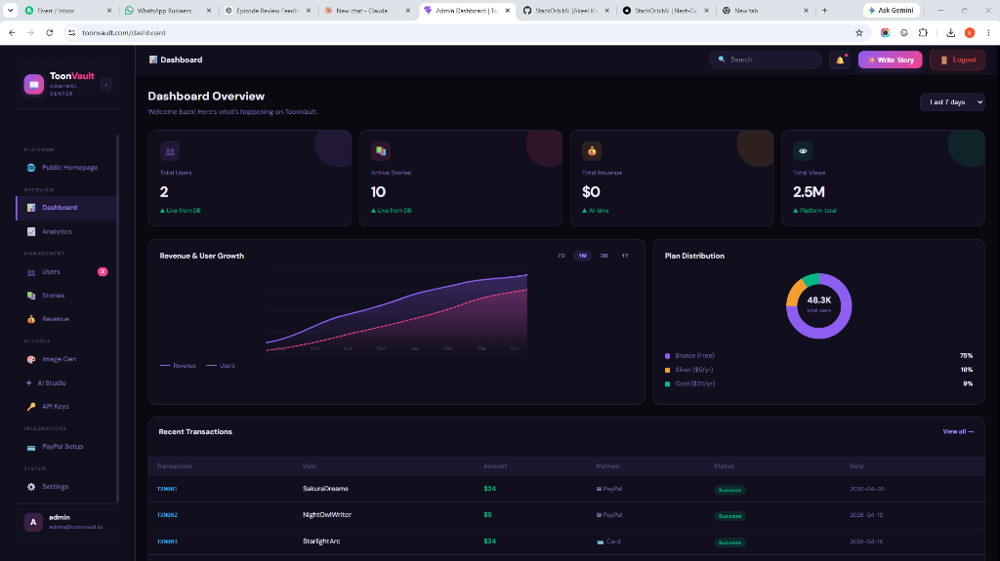
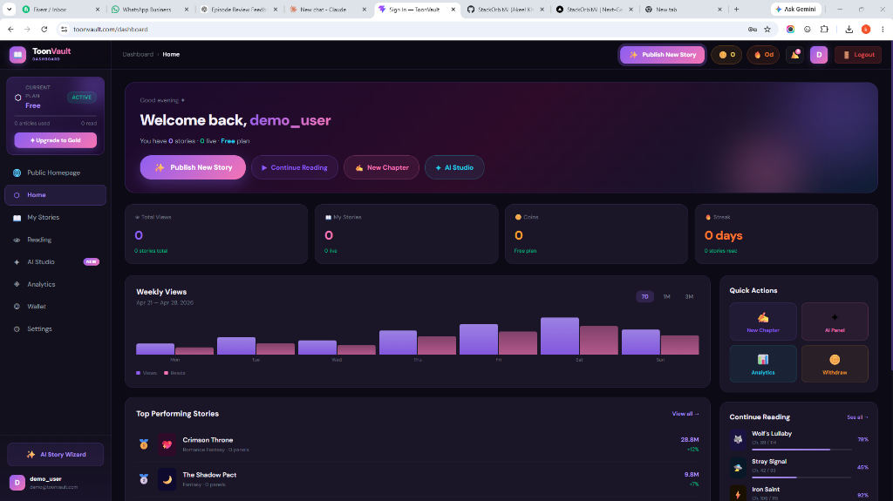
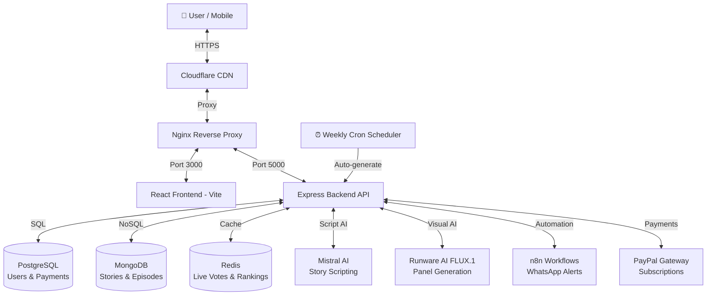

# 🤖 ToonVault — AI-Powered Automated Webtoon & Story Generation Platform

<div align="center">

[](#)
[](#)
[](#)
[](https://toonvault.com/)
[](https://github.com/StackOrbitAI)

**The world's first fully AI-automated webtoon publishing platform.**  
1 new story every week · 1 new episode every week · Zero manual work.

</div>

---

## 📸 Platform Screenshots

### 🏠 Homepage — Trending & Popular Stories
*AI-generated stories ranked by views, ratings, and community engagement. New stories published automatically every week.*


---

### 🔍 Browse All Stories — Genre Discovery
*10 stories across 21 genres. AI continuously monitors trends and publishes new stories to fill gaps in genre coverage.*


---

### 🏆 Rankings & Weekly Episode Unlocks
*Real-time leaderboards powered by view counts, community votes, and AI-tracked engagement metrics.*


---

### 💎 Subscription Tiers & Pricing
*Free → Bronze → Silver → Gold tiers with AI story generation credits per tier. Revenue from ads + subscriptions.*


---

### 📱 Mobile Interactive Reader (Immersive Experience)
*Vertical scroll reader with branching choices A/B/C/D, live fan vote tracker, and comment system.*


---

### 📖 Story Details & Episode Reader (Desktop)
*Full episode viewer with scroll-triggered panels, dynamic speech bubbles, and interactive decision cards.*


---

### 🎬 Episode Panel Reader
*Vertical comic scroll with cinematic AI-generated panels, narration overlays, and community discussions.*


---

### 🛡️ Admin Control Center — Dashboard Overview
*Full admin panel with real-time metrics: Total Users, Active Stories, Revenue, and Total Platform Views (2.5M+). Includes Revenue & User Growth chart, Plan Distribution donut chart, and Recent Transactions table.*

**Admin Sidebar Features:**
- 📊 **Dashboard** — Live platform KPIs at a glance
- 📈 **Analytics** — Detailed breakdown by story, genre, and user behaviour
- 👥 **Users** — Manage all users, roles, subscription plans
- 📚 **Stories** — View, edit, delete or feature any story
- 💰 **Revenue** — Transaction history, MRR, subscription breakdown
- 🖼️ **Image Gen** — Trigger AI panel generation from admin UI
- 🤖 **AI Studio** — Manage AI generation queue and config
- 🔑 **API Keys** — Manage Runware + Mistral API credentials
- 💳 **PayPal Setup** — Configure payment gateway from the panel
- ⚙️ **Settings** — Platform-wide configuration controls



---

### 👤 User Dashboard — Creator & Reader Home
*Personalised user home with plan status (Free/Bronze/Silver/Gold), total views, stories published, coins balance, and reading streak. Includes weekly views chart, top performing stories leaderboard, and continue reading shelf.*

**User Dashboard Features:**
- 🏠 **Home** — Welcome screen with quick action buttons (Publish Story, Continue Reading, New Chapter, AI Studio)
- 📚 **My Stories** — All published stories with live view counts and panel stats
- 📖 **Reading** — Saved reading progress across all bookmarked webtoons
- 🤖 **AI Studio** — Enter a prompt → AI generates a complete story with panels
- 📊 **Analytics** — View views, reads, and engagement on your own stories
- 💰 **Wallet** — Coin balance, purchase history, and withdrawal options
- ⚙️ **Settings** — Profile, notification, and account preferences
- 🔔 **Upgrade to Gold** — One-click plan upgrade from sidebar



---

## 🌟 Platform Overview

ToonVault is an **AI-first** interactive manhwa & webtoon platform where:

- 📅 **1 new story is auto-generated every week** using AI trend research
- 📅 **1 new episode releases every week** per active story — fully automated
- 🤖 **Users can generate their own stories** by entering a prompt — AI does the rest
- 💬 **Community feedback drives future episodes** — AI reads votes & comments to shape storylines
- 💰 **Revenue from ads + subscriptions** — Google AdSense + PayPal payment gateway
- 📲 **Real-time WhatsApp alerts** for admin via n8n automation workflows

---

## 🤖 AI Automation System — Full Architecture

This is the core of ToonVault. The entire content lifecycle is automated:

```
┌─────────────────────────────────────────────────────────────────┐
│              ToonVault AI Automation Loop (Weekly)              │
│                                                                 │
│  1. TREND RESEARCH                                              │
│     └── Scrapes trending anime/manhwa topics, community demand  │
│         and popular genres from multiple sources               │
│                                                                 │
│  2. STORY GENERATION (1 new story/week)                         │
│     └── Mistral AI generates:                                   │
│         • Story title, genre, description                       │
│         • Full script with branching paths A/B/C/D              │
│         • Image prompts for each panel                         │
│         • Character dialogue and narrations                    │
│                                                                 │
│  3. VISUAL PANEL GENERATION                                     │
│     └── Runware AI (FLUX.1 model) generates:                    │
│         • 20 panels per episode (704×1024px)                    │
│         • 28 inference steps, CFG Scale 7                       │
│         • Consistent manhwa art style                          │
│                                                                 │
│  4. AUTO-PUBLISH TO DATABASE                                    │
│     └── Story + panels saved to MongoDB                        │
│         Metadata indexed in PostgreSQL                         │
│         Story goes live on the platform instantly              │
│                                                                 │
│  5. EPISODE SCHEDULER (1 new episode/week per story)            │
│     └── Cron job triggers new episode generation               │
│         AI continues the story from previous context           │
│         Published automatically — no manual work               │
│                                                                 │
│  6. COMMUNITY FEEDBACK LOOP                                     │
│     └── AI analyzes: votes, comments, poll results             │
│         Most-requested plot directions shape next episode       │
│         User feedback becomes part of the story                │
└─────────────────────────────────────────────────────────────────┘
```

### Automation Components

| Component | Technology | Role |
|-----------|-----------|------|
| **Trend Research** | Custom scraper scripts | Identifies trending story themes weekly |
| **Script Writer** | Mistral AI API | Generates full story scripts with branching choices |
| **Panel Artist** | Runware AI (FLUX.1) | Generates 20 manga/manhwa panels per episode |
| **Story Publisher** | Node.js + MongoDB | Auto-saves and publishes completed stories |
| **Episode Scheduler** | Cron jobs (node-cron) | Weekly automated episode generation & publishing |
| **Feedback Analyzer** | Backend analysis logic | Reads votes & comments to influence next episode |
| **Admin Alerts** | n8n + WhatsApp | Sends real-time notifications for key events |

---

## 🌟 Key Platform Features

### 1. 🎬 Immersive Vertical Webtoon Reader
- Continuous vertical scroll format optimized for mobile and desktop
- Dynamic **Manhwa Speech Bubbles & Narrations** with `framer-motion` animations
- Cinematic bottom-gradient overlay for narrations
- Live scroll-progress tracking bar
- Auto-dismissing toast notifications (no disruptive popups)

### 2. 🛤️ Branching Storylines & Player Choice
- Interactive pathways **A, B, C** with instant panel/dialogue swaps
- **Choice D — Write Your Own**: Users submit custom story twists
- Visual quest map for exploring all unlocked narrative branches
- Each choice tracked and tallied in real-time community polls

### 3. 📊 Live Fan Vote Tracker
- Real-time vote counts per narrative branch
- Animated progress bars showing community preferences
- Vote data feeds back into AI episode generation

### 4. 💬 Social & Community System
- Full discussion boards with comment likes and nested replies
- Creator follow system with live follower counts
- Personal **Vault** — bookmark stories and track reading progress

### 5. ⚙️ AI Manhwa Engine v1 (Story + Episode Generation)
- **For Users**: Enter a story idea → AI generates complete story with panels
- **For Admins**: Automated weekly new story creation from trend data
- **Engine**: Runware AI FLUX.1 model + Mistral AI for scripting
- **Quality**: 704×1024px panels, 28 steps, CFG Scale 7

### 6. 📅 Weekly Automated Release Schedule
- **Every week**: 1 brand new story published automatically
- **Every week**: 1 new episode released per active story
- **Zero manual work** required after initial setup
- **Consistent content flow** keeps SEO rankings growing

### 7. 💰 Multi-Revenue Monetization

#### Subscription Tiers
| Tier | Price | Stories/mo | AI Generations | Features |
|------|-------|-----------|---------------|---------|
| **Free** | $0 | 10 | 5 | Community access, standard reading |
| **Bronze** | $4.99 | 50 | 20 | Advanced AI tools, no ads, offline reading |
| **Silver** | $9.99 | 100 | 50 | Priority AI gen, early access, custom themes |
| **Gold** | $19.99 | Unlimited | Unlimited | Pro AI studio, direct support, exclusive content |

#### Ad Revenue
- **Google AdSense** integration for free-tier readers
- Banner ads between episodes for non-subscribers
- Premium subscribers enjoy an **ad-free** experience

### 8. 📲 Admin Automation & Notifications (n8n)
- **WhatsApp Alerts** when new users register
- **WhatsApp Alerts** when subscriptions are purchased
- **Weekly Reports** of subscriber growth, revenue, and story performance
- **Email Marketing** workflows for onboarding and engagement campaigns
- **Abandoned checkout** reminders via automated sequences

---

## 🏛️ System Architecture



### Technology Stack

| Layer | Technology |
|-------|-----------|
| **Frontend** | React.js (Vite), Framer Motion, Lucide Icons, Axios, Tailwind CSS |
| **Backend** | Node.js, Express.js, Mongoose, Sequelize |
| **Primary DB** | PostgreSQL — User management, subscriptions, payment logs |
| **Document DB** | MongoDB — Stories, episodes, panels, dialogues, interactive maps |
| **Cache / Queue** | Redis — Live vote sets, story rankings, active poll trackers |
| **AI — Script** | Mistral AI — Story generation, dialogue, image prompts |
| **AI — Visuals** | Runware AI (FLUX.1) — Manhwa panel image generation |
| **Payments** | PayPal SDK — Subscription tiers and one-time purchases |
| **Automation** | n8n — WhatsApp alerts, email workflows, admin notifications |
| **Web Server** | Nginx — SSL termination, reverse proxy, static asset serving |
| **Containers** | Docker + Docker Compose — Full microservices orchestration |

---

## 🚀 Quick Start (Local Development)

### Prerequisites
- [Node.js v18+](https://nodejs.org/)
- [Docker & Docker Compose](https://www.docker.com/)

### 1. Clone the Repository
```bash
git clone https://github.com/StackOrbitAI/toonvault-ai-powered-automated-story-generation.git
cd toonvault-ai-powered-automated-story-generation
```

### 2. Configure Environment Variables
Create `backend/.env`:
```bash
# Databases
MONGO_URI=mongodb://mongo:27017/toonvault
DATABASE_URL=postgres://user:password@db:5432/toonvault
REDIS_URL=redis://redis:6379

# AI Engine Keys
MISTRAL_API_KEY=your_mistral_api_key
RUNWARE_API_KEY=your_runware_api_key
RUNWARE_MODEL=runware:100@1

# Auth & Payments
JWT_SECRET=your_jwt_secret
PAYPAL_CLIENT_ID=your_paypal_client_id
PAYPAL_CLIENT_SECRET=your_paypal_secret

# Server
PORT=5000
```

Create `frontend/.env`:
```bash
VITE_API_BASE=http://localhost:5000
```

### 3. Launch All Services
```bash
docker compose up -d --build
```

Visit **[http://localhost:8081](http://localhost:8081)** once all containers are healthy.

---

## 📦 Production Deployment

### Deploy with Live Config (VPS / DigitalOcean / Linode)
```bash
docker compose -f docker-compose.live.yml up -d --build
```

### SSL Certificate Setup
```bash
docker compose exec nginx certbot --nginx -d toonvault.com -d www.toonvault.com
```

### Volume Mounts (Production Data Persistence)
```bash
/data/coolify/applications/toonvault/postgres   # PostgreSQL data
/data/coolify/applications/toonvault/mongo      # MongoDB data
/data/coolify/applications/toonvault/redis      # Redis data
/data/coolify/applications/toonvault/uploads    # AI-generated images
```

---

## 🤖 AI Story Generation — Manual Run

### Configure Engine
Edit `backend/story_engine.config.json`:
```json
{
  "engine": {
    "name": "ToonVault Manhwa Engine v1",
    "provider": "Runware AI",
    "model": "runware:100@1"
  },
  "imageSettings": {
    "width": 704,
    "height": 1024,
    "steps": 28,
    "CFGScale": 7
  }
}
```

### Generate a New Story
```bash
# Copy generator into running backend container
docker cp backend/generate_professional_story.js toonvault-backend-1:/app/
docker cp backend/story_engine.config.json toonvault-backend-1:/app/

# Run generation
docker exec toonvault-backend-1 node /app/generate_professional_story.js
```

The script prints the Story ID and live reader URL when done ✅

### Generate Next Episode for Existing Story
```bash
docker cp backend/generate_next_ep.js toonvault-backend-1:/app/
docker exec toonvault-backend-1 node /app/generate_next_ep.js <STORY_ID>
```

---

## 📅 Weekly Automation Setup (Cron)

To activate the fully automated weekly story + episode generation loop, add these cron jobs on your server:

```bash
# Generate 1 new story every Monday at 9:00 AM
0 9 * * 1 docker exec toonvault-backend-1 node /app/generate_professional_story.js >> /var/log/toonvault_story_gen.log 2>&1

# Generate next episode for all active stories every Friday at 9:00 AM
0 9 * * 5 docker exec toonvault-backend-1 node /app/generate_next_ep.js >> /var/log/toonvault_ep_gen.log 2>&1
```

Or use `node-cron` inside the backend for in-process scheduling.

---

## 🔧 Admin Setup

### Promote a User to Admin
```bash
docker exec -it toonvault-backend-1 node -e "
const mongoose = require('mongoose');
const User = require('./models/User');
mongoose.connect('mongodb://mongo:27017/toonvault').then(async () => {
  await User.findOneAndUpdate({ email: 'your@email.com' }, { role: 'admin' });
  console.log('User promoted to Admin!');
  process.exit(0);
});
"
```

### Seed the Database
```bash
docker compose exec backend node seed_stories.js
```

---

## 🗺️ Roadmap

| Feature | Status |
|---------|--------|
| AI Story Generation (Mistral + Runware) | ✅ Live |
| Weekly Automated Story Releases | ✅ Ready |
| Weekly Automated Episode Releases | ✅ Ready |
| Branching Choice System (A/B/C/D) | ✅ Live |
| Live Fan Vote Tracker | ✅ Live |
| Creator Follow System | ✅ Live |
| Vault Bookmarks | ✅ Live |
| Subscription Tiers (Free/Bronze/Silver/Gold) | ✅ Live |
| PayPal Payment Integration | ✅ Live |
| Google AdSense Integration | 🔧 In Progress |
| n8n WhatsApp Admin Alerts | 📅 Planned |
| iOS Native App | 📅 Planned |
| Android Native App | 📅 Planned |
| Community Feedback → AI Episode Shaping | 📅 Planned |
| Trending Topic Auto-Detection | 📅 Planned |

---

<div align="center">

## 🌐 Live Platform

**[https://toonvault.com](https://toonvault.com)**

Built with ❤️ by [StackOrbitAI](https://github.com/StackOrbitAI)

*The future of storytelling is automated, interactive, and AI-powered.*

</div>
