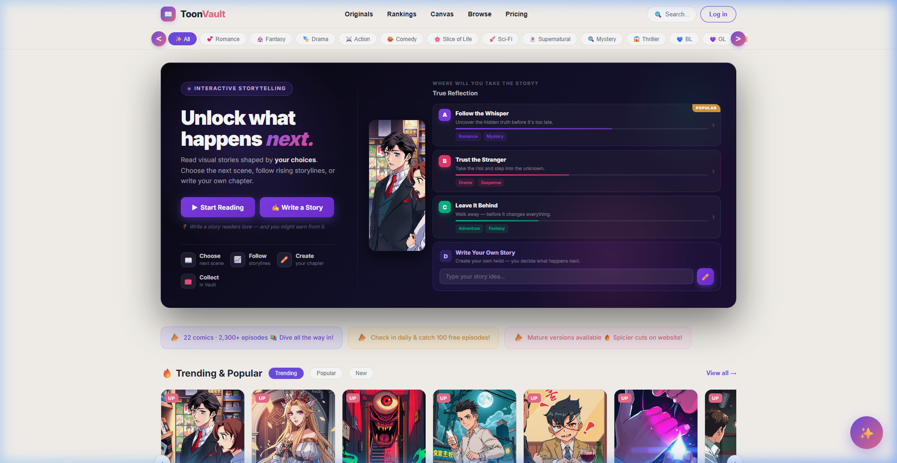
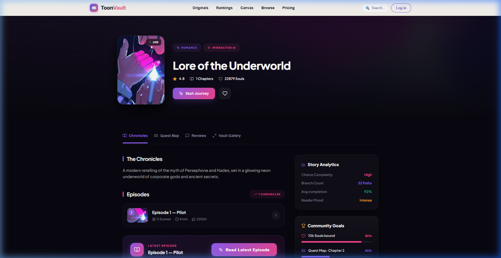
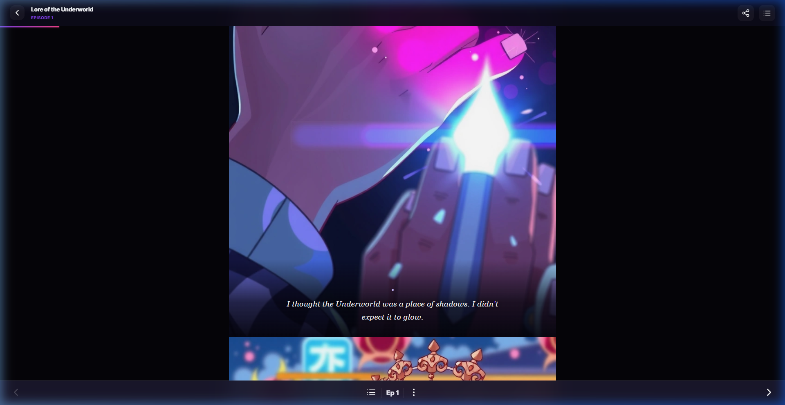
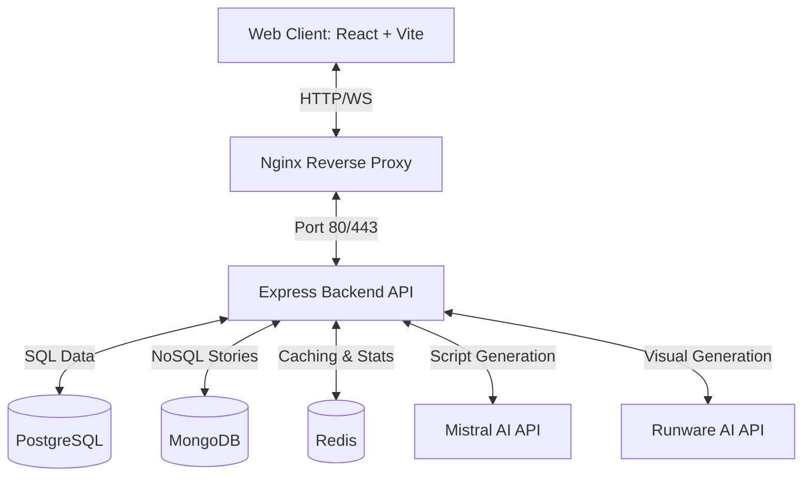

# 🌌 ToonVault — Interactive Manhwa Storytelling Platform

[](#)
[](#)
[](https://github.com/StackOrbitAI)
[](http://toonvault.com/)

ToonVault is a state-of-the-art interactive manhwa (webtoon) publishing and reading platform where readers guide the destiny of the characters. Every choice unlocks a custom narrative outcome, live poll trackers, and scroll-triggered vertical comic scroll episodes. Powered by advanced generative AI for visual content and script narrative structure.

---

## 📸 Visual Preview

### 🖥️ Homepage & Explore
*Discover new and popular stories with dynamic badges, views, ratings, and active creator updates.*


### 📖 Story Details & Choice Traversal
*Browse story details, navigate branching pathways, cast live community poll votes, and participate in discussion threads.*


### 📱 Immersive Vertical Webtoon Reader
*Read seamlessly with a vertical scroll reader featuring dynamic text, floating interactive dialogues, and custom ending path submissions.*


---

## 🌟 Key Features

1. **🎬 Immersive Webtoon Scroll Reader**
   - Continuous vertical scroll format optimized for both desktop and mobile devices.
   - Dynamic **Manhwa Speech Bubbles & Narrations** that float and slide up into place as the reader scrolls them into view using `framer-motion` animations.
   - Cinematic bottom-gradient overlay for narrations and interactive speech bubbles for characters.
   - Live scroll-progress tracking indicator.

2. **🛤️ Branching Storyline & Choice Traversal**
   - Interactive choice pathways (A, B, C) that instantly swap panels and dialogue text on-screen.
   - **Write Your Own Pathway (Choice D)**: Custom text submission updates dialogues dynamically to explore custom, user-written endings.
   - Interactive quest map permitting readers to explore unlocked pathways or navigate backward.

3. **📊 Live Polling & Fan Vote Tracker**
   - Cast votes instantly upon selecting any narrative branch.
   - Live result graphs updating percentages with smooth animations to show community preferences.

4. **💬 Dynamic Social & Discussion Panels**
   - Full discussion boards supporting comment likes, creator follows, and nested inline replies.
   - Vault bookmarks letting readers store stories and track current progress.

5. **⚙️ ToonVault Manhwa Engine v1 (AI-Generated Comics)**
   - Custom generator scripts utilizing **Runware AI** (FLUX.1 model) for vertical webtoon panels.
   - High-fidelity **Mistral AI** integration for automated story structuring, dialogue, and image prompt generation.

---

## 🏛️ System Architecture

ToonVault is built as a microservices architecture orchestrated with Docker.



### Technology Stack
* **Frontend**: React.js (Vite), Framer Motion, Lucide Icons, Axios, Tailwind CSS.
* **Backend**: Node.js, Express.js, Mongoose, Sequelize.
* **Primary SQL DB**: PostgreSQL (User management, follow stats, and transaction logs).
* **NoSQL DB**: MongoDB (Chapters, panels metadata, story dialogues, and interactive maps).
* **Caching & High-Speed Cache**: Redis (Likes sets, live story rankings, active poll trackers).
* **WebServer & Proxy**: Nginx (Reverse proxy mapping frontend routes and backend APIs securely).
* **Containerization**: Docker, Docker Compose.

---

## 🚀 Quick Start (Local Development)

### Prerequisites
Make sure you have [Node.js (v18+)](https://nodejs.org/) and [Docker](https://www.docker.com/) installed.

### 1. Clone the Project
```bash
git clone https://github.com/StackOrbitAI/toonvault.git
cd toonvault
```

### 2. Configure Environment Variables
Create a `.env` file inside the `backend/` directory:
```bash
# Database & Caching
MONGO_URI=mongodb://mongo:27017/toonvault
DATABASE_URL=postgres://user:password@db:5432/toonvault
REDIS_URL=redis://redis:6379

# AI Engines API Keys
MISTRAL_API_KEY=your_mistral_api_key
RUNWARE_API_KEY=your_runware_api_key
RUNWARE_MODEL=runware:100@1

# System Settings
PORT=5000
JWT_SECRET=your_jwt_secret_key
```

Create a `.env` file inside the `frontend/` directory:
```bash
VITE_API_BASE=http://localhost:5000
```

### 3. Launch Development Environment
Deploy the system locally:
```bash
docker compose up -d --build
```
Once healthy, access the platform at **[http://localhost:8081](http://localhost:8081)**.

---

## 📦 Production Deployment Guide

ToonVault can be deployed on any virtual private server (VPS like DigitalOcean, AWS, Linode, or Coolify environments) easily.

### 1. Set Up Production Compose
For production, use the `docker-compose.prod.yml` configuration:
```bash
docker compose -f docker-compose.prod.yml up -d --build
```

### 2. Set Up Let's Encrypt SSL Certificates
Configure Nginx with automatic SSL certificates:
```bash
docker compose exec nginx certbot --nginx -d toonvault.com -d www.toonvault.com
```

### 3. Mount Volumes
Ensure your host directories for database storage are mounted correctly:
- PostgreSQL data: `/data/coolify/applications/toonvault/postgres`
- Redis data: `/data/coolify/applications/toonvault/redis`
- MongoDB data: `/data/coolify/applications/toonvault/mongo`
- Uploads/Images: `/data/coolify/applications/toonvault/uploads`

---

## 🎨 Manual Story Generation (Manhwa Engine v1)

ToonVault has an automated generator utility allowing creators to build a complete manhwa series with episodes in seconds.

### 1. Configure Engine Settings
Engine config is located at `backend/story_engine.config.json`. Update it to adjust resolution or style defaults:
```json
{
  "engine": {
    "name": "ToonVault Manhwa Engine v1",
    "provider": "Runware AI",
    "model": "runware:100@1"
  },
  "imageSettings": {
    "width": 704,
    "height": 1024,
    "steps": 28,
    "CFGScale": 7
  }
}
```

### 2. Run the Professional Generator Script
Edit the storyboard inside `backend/generate_professional_story.js` and execute:
```bash
# Copy generator into running backend container
docker cp backend/generate_professional_story.js toonvault-backend-1:/app/
docker cp backend/story_engine.config.json toonvault-backend-1:/app/

# Execute generation
docker exec toonvault-backend-1 node /app/generate_professional_story.js
```
The script will output the new **Story ID** and the **Story Reader URL** instantly upon completing.

---

## 📖 Seeding the Database
To populate the database with default interactive stories and quest maps:
```bash
docker compose exec backend node seed_stories.js
```

---

## 🔧 Admin Setup
Register a user through the UI, then run this command inside the backend container to promote the user to admin status:
```bash
docker exec -it toonvault-backend-1 node -e "
const mongoose = require('mongoose');
const User = require('./models/User');
mongoose.connect('mongodb://mongo:27017/toonvault').then(async () => {
  await User.findOneAndUpdate({ email: 'your@email.com' }, { role: 'admin' });
  console.log('User promoted to Admin successfully!');
  process.exit(0);
});
"
```

---

<div align="center">
  <h3>Developed with ❤️ by <a href="https://github.com/StackOrbitAI">StackOrbitAI</a></h3>
  <p><a href="http://toonvault.com/">toonvault.com</a></p>
</div>
